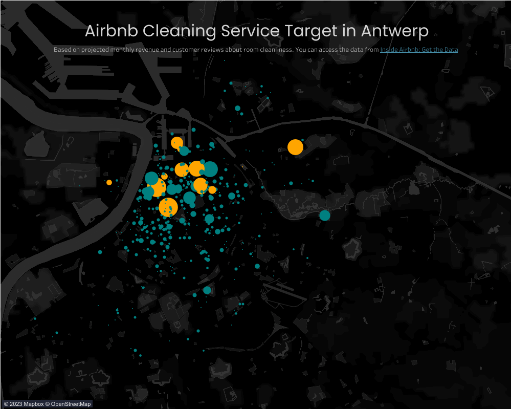

# Airbnb Data Analytics With Bigquery, Google Spreadsheet, and Tableau

interactive version could be accessed at:
https://public.tableau.com/views/AirbnbCleaningServiceMarketMapping/Dashboard1?:language=en-US&:display_count=n&:origin=viz_share_link 

## Table of Contents

- [Project Overview](#project-overview)
- [Data](#data)
- [Data Preprocessing](#data-preprocessing)
- [Database Design](#database-design)
- [Visualization](#visualization)
- [Acknowledgement](#acknowledgement)
- [Contact](#contact)

## Project Overview

This data analytics project involves leveraging Bigquery for the processing and transformation of extensive Airbnb datasets. To overcome the limitations of Bigquery in handling unstructured text data, a spreadsheet is used for data preprocessing. The project concludes with data visualization using Tableau.

## Data

The data for this project is acquired from airbnb site:
http://insideairbnb.com/get-the-data/ 

## Preprocessing
The incorporation of a spreadsheet primarily serves to facilitate database acquisition in Bigquery, as direct data uploads to Bigquery have shown susceptibility to errors. Additionally, the spreadsheet is employed for essential data cleaning tasks, involving the removal of irrelevant columns from the datasets.

## Database Design
The dataset comprises two components: reviews and listings. Within the listings dataset, each row represents a distinct room available in the Airbnb service for Antwerp, Belgium. In BigQuery, these datasets are linked using a common identifier. Additionally, a host dataset is constructed, encompassing the entire property ownership within specific coordinates. This enables the mapping of booking order distribution throughout the city.

Furthermore, a projected revenue column is generated and aggregated based on hosts. Additionally, customer sentiment regarding room cleanliness is extracted from the reviews dataset, facilitating the mapping of potential markets for cleaning services throughout the city.

## Visualization
The output mapping is visualized using Tableau, accessible through the link provided above.

## Acknowledgment
This project draws significant inspiration from [AveryData's YouTube video](https://www.youtube.com/watch?v=CHb-QvGcRjw), which served as a foundational reference. While building upon the concepts presented in the video, we've taken an additional step by leveraging Bigquery for data processing and engineering. Moreover, we've enhanced the project's value by incorporating data visualization to provide deeper insights into the results.

## Contact
For questions or further information, please contact mahendrayana at [mahendrayana203@gmail.com].